# Guía de Contribución y Calidad de Código

## 📋 Checklist Obligatorio Antes de Push/PR

Antes de hacer **push** o abrir un **Pull Request**, cada integrante **DEBE** ejecutar:

### 1. ✅ Verificar Linting
```bash
npm run lint
```
- Corrige **todos** los errores de ESLint.
- No se permiten warnings en el código a mergear.

### 2. ✅ Compilar el Proyecto
```bash
npm run build
```
- Confirma que el proyecto compila sin errores.
- Verifica que se genera la carpeta `dist/` correctamente.

### 3. ✅ Ejecutar Tests con Cobertura
```bash
npm test -- --coverage
```
- Verifica que **todos los tests pasen**.
- Confirma que se genera el archivo `coverage/lcov.info`.
- Revisa el reporte de cobertura en terminal.

### 4. ✅ Validar Cobertura Mínima
- **Cobertura en nuevo código: ≥ 80%**
- Verifica los porcentajes en:
  - **Statements**: ≥ 80%
  - **Branches**: ≥ 80%
  - **Functions**: ≥ 80%
  - **Lines**: ≥ 80%

### 5. ✅ Quality Gate de SonarCloud
- Una vez abierto el PR, espera a que **SonarCloud** complete el análisis.
- El PR **NO** se puede mergear si:
  - ❌ Quality Gate falla
  - ❌ Cobertura en nuevo código < 80%
  - ❌ Existen code smells críticos
  - ❌ Hay vulnerabilidades de seguridad

---

## 🧪 Configuración de Tests

### Stack de Testing
- **Jest**: Framework de testing
- **React Testing Library**: Para componentes React
- **@testing-library/user-event**: Para simular interacciones de usuario

### Comandos Disponibles
```bash
# Ejecutar todos los tests
npm test

# Ejecutar tests en modo watch (desarrollo)
npm run test:watch

# Generar reporte de cobertura
npm run test:coverage
```

---

## 📝 Estándares para Escribir Tests

### Tests Obligatorios por Componente

Para **cada componente nuevo**, se deben crear tests que cubran:

1. **Renderizado básico**
   ```tsx
   it('should render without crashing', () => {
     render(<MyComponent />);
     expect(screen.getByText(/expected text/i)).toBeInTheDocument();
   });
   ```

2. **Props y estados**
   ```tsx
   it('should display prop value correctly', () => {
     render(<MyComponent title="Test Title" />);
     expect(screen.getByText('Test Title')).toBeInTheDocument();
   });
   ```

3. **Interacciones del usuario**
   ```tsx
   it('should handle click events', async () => {
     const user = userEvent.setup();
     const handleClick = jest.fn();
     render(<MyComponent onClick={handleClick} />);
     
     await user.click(screen.getByRole('button'));
     expect(handleClick).toHaveBeenCalledTimes(1);
   });
   ```

4. **Renderizado condicional**
   ```tsx
   it('should show error message when error prop is true', () => {
     render(<MyComponent error={true} />);
     expect(screen.getByText(/error/i)).toBeInTheDocument();
   });
   ```

### Ejemplo Completo: Button Component

**`src/components/Button/Button.tsx`**
```tsx
interface ButtonProps {
  label: string;
  onClick?: () => void;
  disabled?: boolean;
  variant?: 'primary' | 'secondary';
}

export const Button = ({ 
  label, 
  onClick, 
  disabled = false,
  variant = 'primary' 
}: ButtonProps) => {
  return (
    <button
      onClick={onClick}
      disabled={disabled}
      className={`btn btn-${variant}`}
      data-testid="custom-button"
    >
      {label}
    </button>
  );
};
```

**`src/components/Button/Button.test.tsx`**
```tsx
import { render, screen } from '@testing-library/react';
import userEvent from '@testing-library/user-event';
import { Button } from './Button';

describe('Button Component', () => {
  it('should render with label', () => {
    render(<Button label="Click Me" />);
    expect(screen.getByText('Click Me')).toBeInTheDocument();
  });

  it('should call onClick when clicked', async () => {
    const user = userEvent.setup();
    const handleClick = jest.fn();
    render(<Button label="Click" onClick={handleClick} />);
    
    await user.click(screen.getByRole('button'));
    expect(handleClick).toHaveBeenCalledTimes(1);
  });

  it('should be disabled when disabled prop is true', () => {
    render(<Button label="Click" disabled={true} />);
    expect(screen.getByRole('button')).toBeDisabled();
  });

  it('should apply correct variant class', () => {
    render(<Button label="Click" variant="secondary" />);
    const button = screen.getByTestId('custom-button');
    expect(button).toHaveClass('btn-secondary');
  });

  it('should not call onClick when disabled', async () => {
    const user = userEvent.setup();
    const handleClick = jest.fn();
    render(<Button label="Click" onClick={handleClick} disabled={true} />);
    
    await user.click(screen.getByRole('button'));
    expect(handleClick).not.toHaveBeenCalled();
  });
});
```

---

## 🚫 Archivos Excluidos de Cobertura

Los siguientes archivos están **excluidos automáticamente**:

- ✅ `src/main.tsx` - Entry point de la aplicación
- ✅ `src/vite-env.d.ts` - Tipos de Vite
- ✅ `**/*.d.ts` - Archivos de definición de tipos
- ✅ `**/__mocks__/**` - Archivos de mocks
- ✅ `**/*.test.{ts,tsx}` - Archivos de test
- ✅ `**/*.spec.{ts,tsx}` - Archivos de spec

> **Nota**: Si necesitas excluir otros archivos, modifica `collectCoverageFrom` en `jest.config.ts`.

---

## 🤖 GitHub Copilot - Asistente de Tests

GitHub Copilot está configurado para **sugerir tests automáticamente**. 

### Cómo usar Copilot para generar tests:

1. **Crea el archivo de test**: `ComponentName.test.tsx`
2. **Escribe el inicio del describe**:
   ```tsx
   import { render, screen } from '@testing-library/react';
   import { ComponentName } from './ComponentName';

   describe('ComponentName', () => {
     // Copilot sugerirá tests aquí
   ```
3. **Acepta las sugerencias** y ajusta según sea necesario.

---

## 📊 Visualizar Reporte de Cobertura

Después de ejecutar `npm run test:coverage`, abre:

```bash
# Ver reporte HTML en el navegador
open coverage/lcov-report/index.html
# o en Linux
xdg-open coverage/lcov-report/index.html
```

---

## ⚠️ Políticas de Calidad

### ❌ NO se aceptarán PRs que:
- No pasen todos los tests
- Tengan cobertura < 80% en código nuevo
- Fallen el Quality Gate de SonarCloud
- Contengan code smells críticos sin resolver
- Tengan vulnerabilidades de seguridad

### ✅ Buenas Prácticas:
- Escribe tests **antes** de implementar (TDD recomendado)
- Mantén los tests **simples y legibles**
- Usa **nombres descriptivos** para los tests
- **No testees implementación**, testea comportamiento
- Mockea dependencias externas (APIs, localStorage, etc.)

---

## 🔄 Workflow Completo

```mermaid
graph TD
    A[Desarrollar Feature] --> B[Escribir Tests]
    B --> C[npm run lint]
    C --> D{Linting OK?}
    D -->|No| C
    D -->|Sí| E[npm run build]
    E --> F{Build OK?}
    F -->|No| A
    F -->|Sí| G[npm test --coverage]
    G --> H{Tests Pasan?}
    H -->|No| B
    H -->|Sí| I{Cobertura ≥80%?}
    I -->|No| B
    I -->|Sí| J[git commit + push]
    J --> K[Abrir PR]
    K --> L[SonarCloud Analysis]
    L --> M{Quality Gate Pasa?}
    M -->|No| A
    M -->|Sí| N[Mergear PR]
```



---

## 📚 Recursos Adicionales

- [Jest Documentation](https://jestjs.io/docs/getting-started)
- [React Testing Library](https://testing-library.com/docs/react-testing-library/intro/)
- [Testing Library Best Practices](https://kentcdodds.com/blog/common-mistakes-with-react-testing-library)
- [SonarCloud Quality Gate](https://docs.sonarcloud.io/improving/quality-gates/)

---

## 🆘 Soporte

Si tienes problemas con los tests o la configuración:

1. Revisa la [documentación de Jest](https://jestjs.io/)
2. Consulta con el Tech Lead del proyecto
3. Abre un issue en el repositorio con el tag `testing`

---

**Recuerda**: La calidad del código es responsabilidad de **todo el equipo**. 
Los tests no son opcionales, son parte integral del desarrollo.
